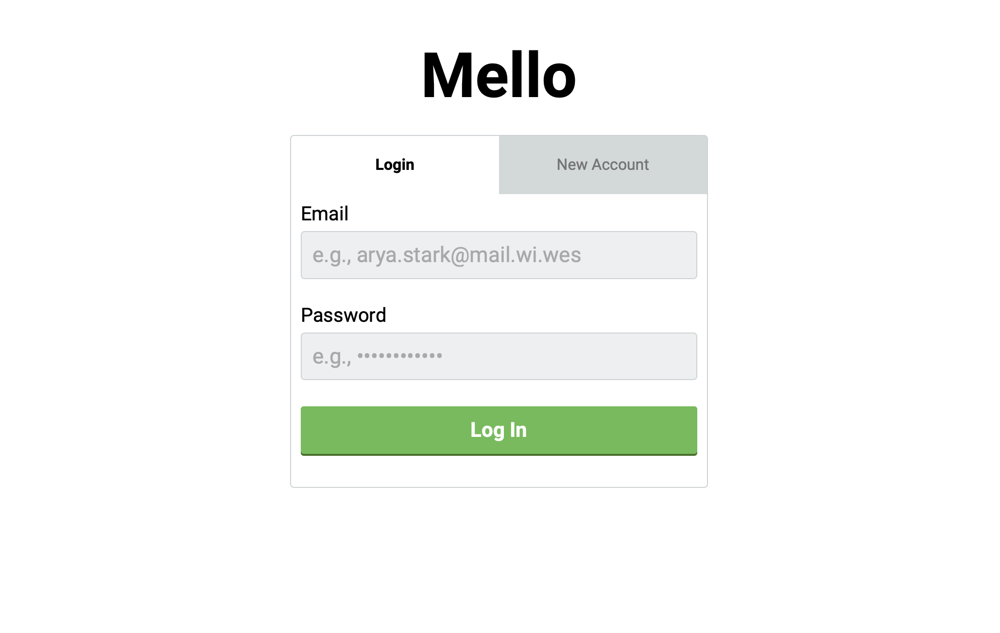
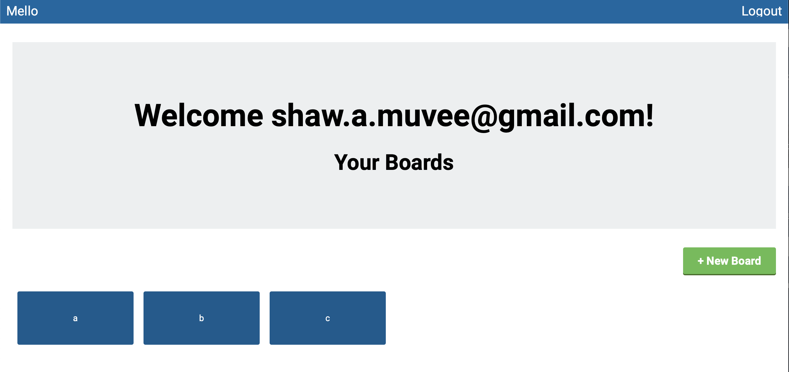
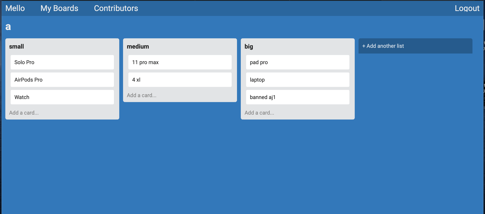
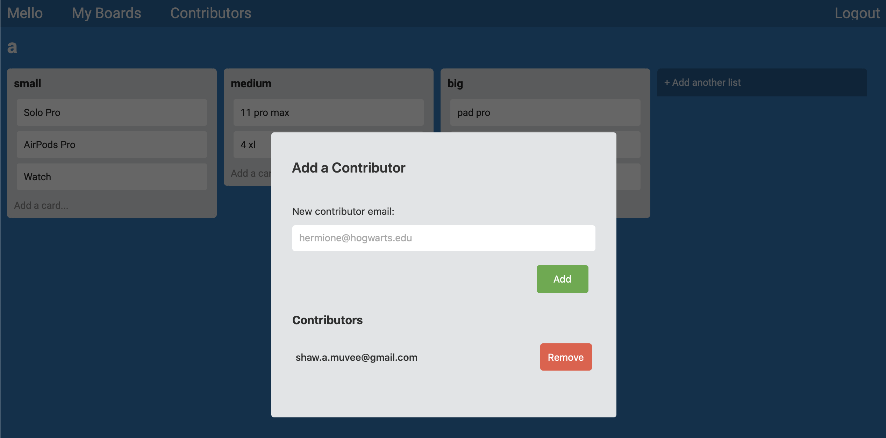

# README

MELLO FRONTEND.

This is a JS project for learning purpose.

This app is tented to create a Trello like app.

I learn to make it from UT web developer bootcamp.

link: https://mello-rails-bshaw.herokuapp.com

